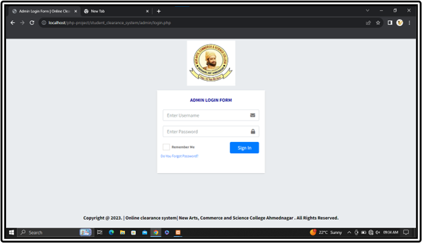
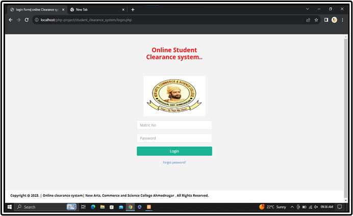
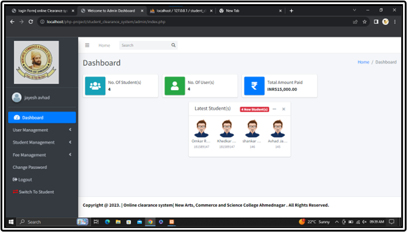
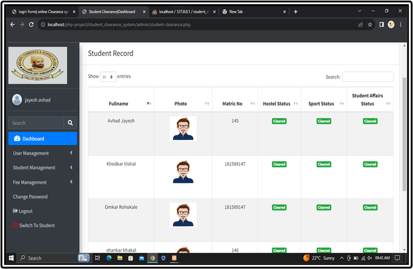
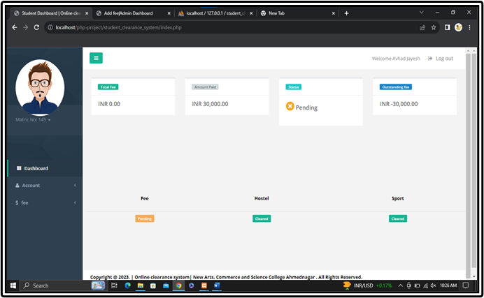
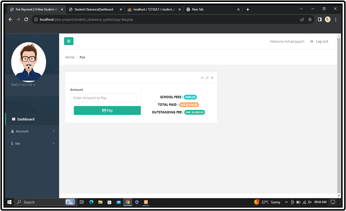

# 🎓 Student Clearance System

A **web-based Student Clearance Management System** developed as a **BCA Final Year Project**.  
This system digitizes the traditional manual student clearance process used in colleges and universities.

Instead of visiting multiple departments physically, students can track their clearance status online while departments approve requests through the admin panel.

---

## 📌 Project Overview

The **Student Clearance System** helps educational institutions manage student clearance across multiple departments such as:

- Library
- Accounts
- Hostel
- Sports
- Student Affairs

The system allows administrators to monitor student records and clearance approvals efficiently.

---

## 🚀 Features

- Student Login System
- Admin Login Dashboard
- Department-wise clearance approval
- Fee payment management
- Student record management
- Clearance status tracking
- Secure authentication system
- Admin analytics dashboard

---

## 🛠️ Technologies Used

### Frontend
- HTML
- CSS
- Bootstrap
- JavaScript

### Backend
- PHP

### Database
- MySQL

### Server
- XAMPP / WAMP

---

## 📷 Screenshots

### Login Page

### Student Dashboard

### Fee Payment

### Admin Dashboard

### Student Accounts

### Student Records

---

## ⚙️ How to Run the Project

1️⃣ Install **XAMPP or WAMP Server**

2️⃣ Copy the project folder into:
